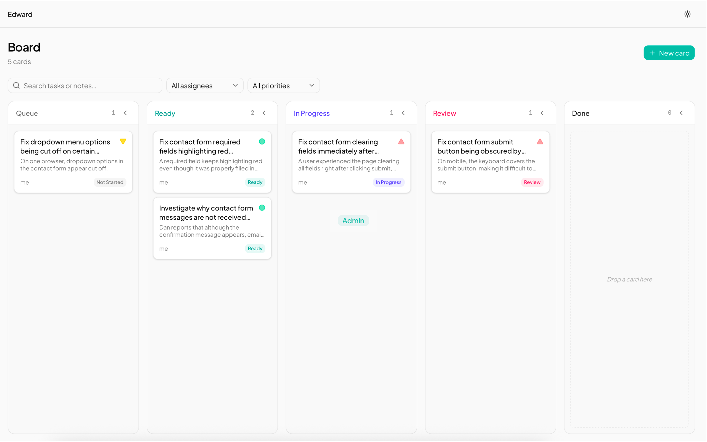
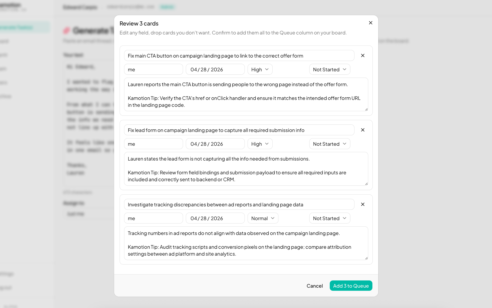
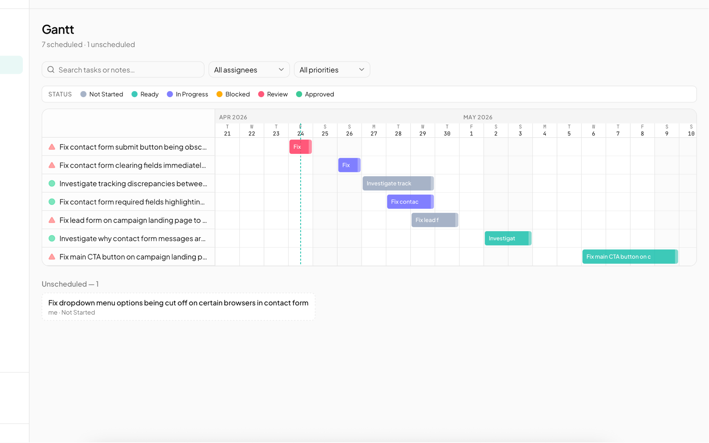

# kamotion

> Paste the noise. Get the work.

<p>
  
</p>

Personal kanban + AI task extractor. Paste unstructured text — meeting transcripts, Slack dumps, email threads, raw notes — and AI extracts the actionable items into cards on a kanban board, with a Gantt view alongside.

Live at **[kamotion.io](https://kamotion.io)** · Invite-only · Built by [Edward Carpio](https://github.com/edwrdcrpio)

## How it works

Paste unstructured text. AI extracts a list of tasks. You review, edit, and confirm before anything hits the board.

<p>
  
</p>

## Gantt view

Same cards, timeline layout. Drag to shift due dates; click through to the card drawer.

<p>
  
</p>

## Docs

Product walkthrough and setup guide: **[kamotion.io/docs](https://kamotion.io/docs)**.

Deep-dive references in this repo:

- **[Stack reference](docs/00_INFO_STACK.md)** — tech, schema, env vars
- **[n8n setup](docs/00_N8N_SETUP.md)** — optional self-hosted AI path
- **[Deployment](docs/00_DEPLOY.md)** — Dokploy + Nixpacks guide

## Stack

Next.js 16 (App Router + Turbopack) · TypeScript strict · Tailwind v4 + shadcn/ui · dnd-kit · TanStack Query v5 · React Hook Form + Zod · Supabase (Postgres + Auth + RLS) · Vercel AI SDK v6 → OpenRouter / Anthropic / OpenAI / Gemini

## Quickstart

```bash
git clone https://github.com/edwrdcrpio/kamotion.io.git
cd kamotion.io
npm install
cp .env.example .env.local
# fill in the Supabase + AI provider keys — see .env.example for the full list
npm run dev
```

Open [http://localhost:3000](http://localhost:3000).

Required variables:

| Var | Where it comes from |
|---|---|
| `NEXT_PUBLIC_SUPABASE_URL` | Supabase Dashboard → Project Settings → API |
| `NEXT_PUBLIC_SUPABASE_ANON_KEY` | Supabase Dashboard → Project Settings → API → `anon public` |
| `SUPABASE_SERVICE_ROLE_KEY` | Supabase Dashboard → Project Settings → API → `service_role` (**secret**) |
| `AI_API_KEY_OPENROUTER` | [OpenRouter](https://openrouter.ai) account → Keys (or substitute `AI_API_KEY_OPENAI` / `_ANTHROPIC` / `_GOOGLE`) |

First-time Supabase setup (migrations + admin user) is documented in [`docs/00_DEPLOY.md`](docs/00_DEPLOY.md). Full stack and env reference in [`docs/00_INFO_STACK.md`](docs/00_INFO_STACK.md).

## License

MIT — see [LICENSE](LICENSE).
