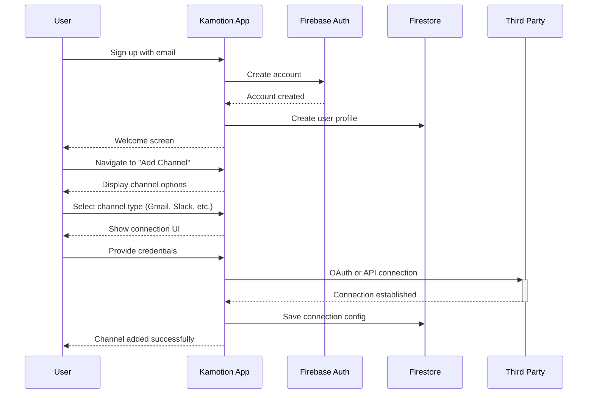
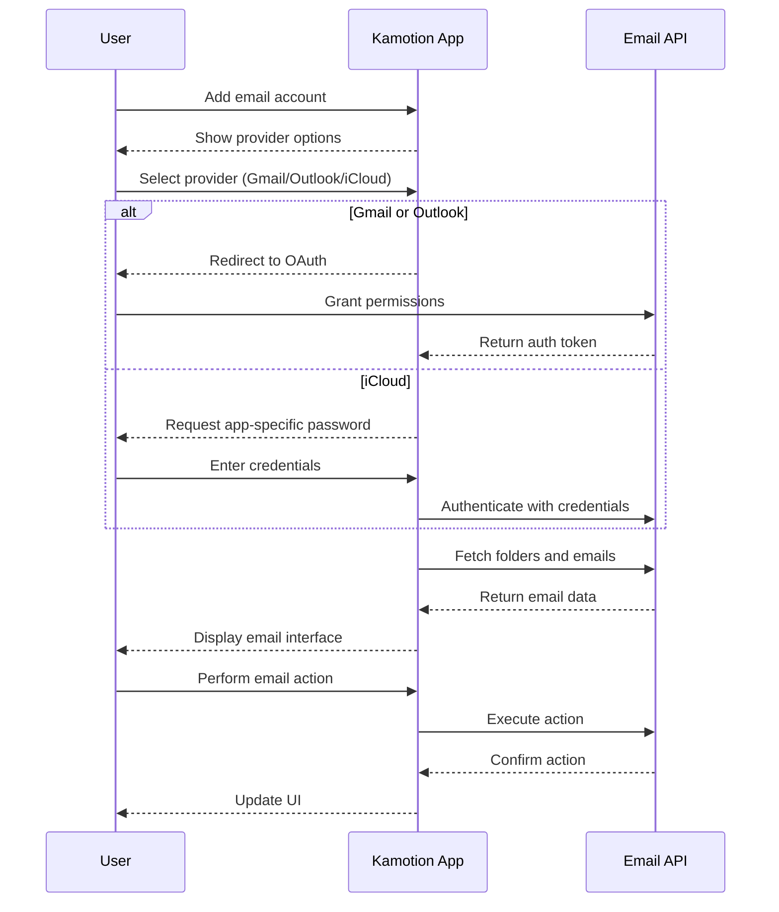
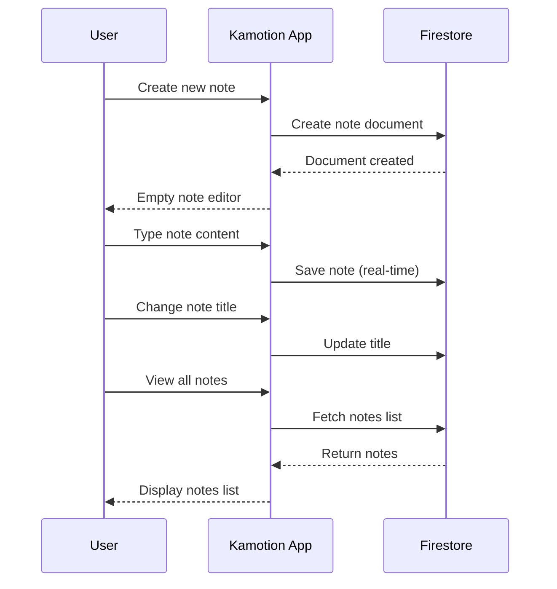

# Kamotion.io Project Specification

## Project Overview

Kamotion.io is a unified interface for managing multiple communication channels, feeds, and productivity tools in one place. The MVP will focus on integrating email providers (Gmail, Outlook, iCloud), Slack, LLM chatbots (OpenAI, Anthropic, Gemini), and a notes feature.

## System Architecture

```mermaid
graph TD
    User(User) -->|Interacts with| FrontEnd(Frontend Application)
    FrontEnd -->|Authentication| FireAuth(Firebase Authentication)
    FrontEnd -->|Stores user configs| FireStore(Firestore Database)
    FrontEnd -->|Direct API calls| ThirdPartyAPI(Third-party APIs)
    FrontEnd -->|Backend operations| Backend(Backend Services)
    
    Backend -->|Proxy when needed| ThirdPartyAPI
    Backend -->|Serverless functions| FireFunctions(Firebase Functions)
    
    subgraph "Integrations"
        Email(Email Services)
        Slack(Slack API)
        LLM(AI/LLM APIs)
    end
    
    ThirdPartyAPI -->|Connects to| Integrations
    
    subgraph "Data Storage"
        UserPrefs(User Preferences)
        Tokens(Security Tokens)
        Notes(User Notes)
    end
    
    FireStore -->|Manages| Data Storage
```

## User Flows

### Account Creation and Setup



### Email Integration Flow



### Notes Feature Flow



## Component Structure

```mermaid
graph TD
    App[App Container] --> Nav[Navigation Component]
    App --> MainLayout[Main Layout]
    
    MainLayout --> Sidebar[Channel Sidebar]
    MainLayout --> ContentArea[Content Area]
    
    Sidebar --> ChannelList[Channel List]
    Sidebar --> AddChannel[Add Channel Button]
    
    ContentArea --> ChannelView[Channel View]
    
    subgraph "Channel Types"
        EmailView[Email View]
        SlackView[Slack View]
        LLMView[LLM Chat View]
        NotesView[Notes View]
    end
    
    ChannelView --> Channel Types
    
    EmailView --> EmailList[Email List]
    EmailView --> EmailContent[Email Content]
    
    LLMView --> ChatHistory[Chat History]
    LLMView --> ChatInput[Chat Input]
    
    NotesView --> NotesList[Notes List]
    NotesView --> NoteEditor[Note Editor]
```

## Data Models

### User Profile
```json
{
  "uid": "string",
  "email": "string",
  "displayName": "string",
  "createdAt": "timestamp",
  "preferences": {
    "theme": "string",
    "layout": "one-column | two-column",
    "defaultChannel": "string"
  }
}
```

### Channel Configuration
```json
{
  "id": "string",
  "userId": "string",
  "type": "email | slack | llm | notes",
  "name": "string",
  "icon": "string",
  "color": "string",
  "collection": "string",
  "isActive": "boolean",
  "createdAt": "timestamp",
  "config": {
    // Differs by channel type
  }
}
```

### Email Channel Config
```json
{
  "provider": "gmail | outlook | icloud",
  "email": "string",
  "displayName": "string",
  // Tokens and credentials stored securely
}
```

### Slack Channel Config
```json
{
  "workspaceName": "string",
  "workspaceId": "string",
  // Tokens stored securely
}
```

### LLM Channel Config
```json
{
  "provider": "openai | anthropic | gemini",
  "displayName": "string",
  // API keys stored securely
}
```

### Note
```json
{
  "id": "string",
  "userId": "string",
  "channelId": "string",
  "title": "string",
  "content": "string",
  "createdAt": "timestamp",
  "updatedAt": "timestamp",
  "tags": ["string"]
}
```

## Tech Stack

1. **Frontend**:
   - React.js
   - React Router for navigation
   - Redux or Context API for state management
   - Styled Components/Tailwind CSS for styling

2. **Backend**:
   - Firebase Functions (Node.js)
   - Firebase Authentication
   - Firestore Database

3. **Integrations**:
   - Gmail API
   - Outlook Graph API
   - iCloud Mail (IMAP/SMTP)
   - Slack API
   - OpenAI API
   - Anthropic API
   - Google Gemini API

## Implementation Phases

### Phase 1: Foundation
- User authentication with Firebase
- Basic UI framework
- Channel configuration storage
- Layout switching (1-column/2-column)

### Phase 2: Email Integration
- Gmail integration via OAuth
- Outlook integration via OAuth
- iCloud Mail integration
- Basic email operations (read, reply, compose)

### Phase 3: Slack Integration
- Slack workspace connection
- Channel and direct message listing
- Message notifications

### Phase 4: LLM Integration
- API key management interface
- Basic chat UI
- Support for multiple LLM providers

### Phase 5: Notes Feature
- Create, edit, delete notes
- Notes organization
- Markdown support

## Security Considerations

1. **API Key Storage**:
   - Encrypt sensitive credentials before storing
   - Use Firebase security rules to restrict access

2. **Authentication**:
   - Use OAuth where possible
   - Implement proper token refresh mechanisms
   - Store tokens securely

3. **Data Privacy**:
   - Minimize data storage to what's necessary
   - Implement proper data deletion
   - Consider client-side operations when possible

## Future Expansion

1. **Additional Integrations**:
   - More email providers
   - Social media platforms (Instagram, Facebook, X)
   - Project management tools (Jira, Monday.com)
   - Customer support platforms (Zendesk)

2. **Enhanced Features**:
   - Full email management (folders, labels)
   - Advanced filtering and search
   - Cross-platform notifications
   - Mobile application

3. **Subscription Model**:
   - Free tier with limited integrations
   - Premium tier with additional features and more integrations
   - Team/enterprise options
